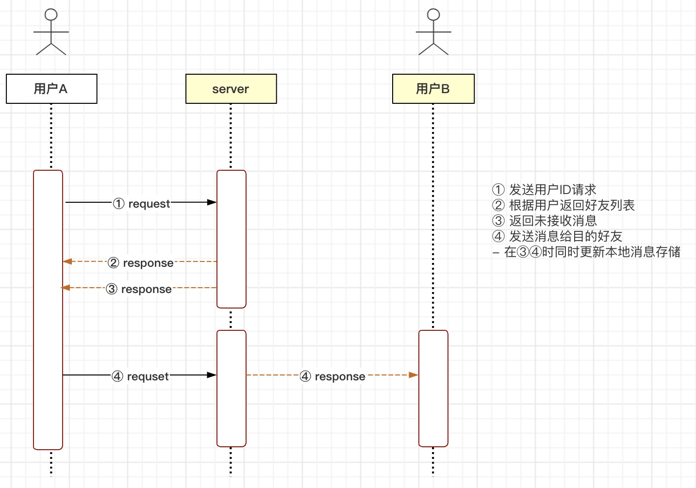

## 描述
  用户端点对点实时通讯
## 项目启动
  ```
  npm install
  cd node
  npm install
  cd ..
  npm run server
  ```
## 流程
  ① 用户端A发送GET请求 /userList?userId=xxx 获取用户A好友列表后渲染到界面  
  ② 用户端A发送GET请求 /port?userId=xxx  
  ③ 服务端接受 /port 请求生成端口号 port, 以端口号 port 创建一个 webSocket 服务, 返回前端端口号 port  
  ④ 用户端A根据 /port 请求返回的端口号 port, 打开 webSocket 连接到服务端  
  ⑤ 用户端A选择用户B发送POST请求 /send 发送消息给用户B, body = {userId: '用户A的ID', targetId: '用户B的ID', content: '文本消息'}  
  ⑥ 服务端接收 /send 请求，查看 SERVER_PORT 用户B当前是否存在打开服务端的 webSocket 连接, 若存在, 则将 body 直接发送到用户B, 若不存在, 则将 body 暂存到 TEMPORARY 等待用户B在步骤③连接到服务端时推送给用户B  
  ⑦ 用户B端通过 webSocket 接收到用户A的消息体并渲染到界面  
## 技术
  - html
    - [websocket](https://developer.mozilla.org/zh-CN/docs/Web/API/WebSocket)
    - [fetch](https://developer.mozilla.org/zh-CN/docs/Web/API/Fetch_API/Using_Fetch)
  - nodejs
    - [express](https://github.com/expressjs/express)
    - [ws](https://github.com/websockets/ws)
  <!-- -  -->
## 存在问题
  1. 本地使用 localStorage 缓存用户聊天记录容易溢出，可考虑服务端持久化存储或前端使用 indexedDB 优化。
  2. 服务端使用 TEMPORARY 缓存等待发送目标用户消息，不稳定，服务挂了消息即丢失。
  3. 创建的 ws 端口冲突以及每个用户需独立创建 ws 服务及端口
## 进阶
  - 消息是否已读状态
  - 发送图片等文件资源
  - 前端交互细节：① 当前选择用户高亮，② 未读消息气泡